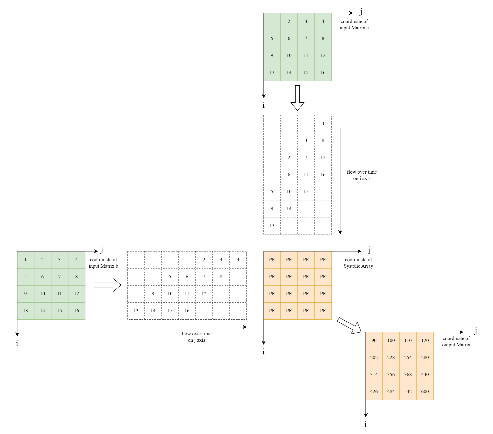

# Systolic Array for Matrix Multiplication

Testbench shows an example of 4x4 matirx multiplication.

Need $N\times 3 -1$ clocks to finish a NxN matrix multiplication.

- `run.sh` default script using pure verilog/systemVerilog
- `run_vpi.sh` implement some function using VPI

There's some bug for VPI which function `get_matrix_a` `get_matrix_b` can't return a 64-bit vector but only 32-bit.